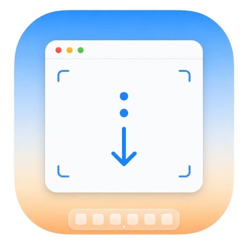

<div align="center">
  
  <h1>OpenSS</h1>
  <p><strong>A minimal macOS menu bar app for long screenshots. Pick a window, auto-scroll to the end, and save one clean PNG.</strong></p>

  <p>
    <a href="#features">Features</a> •
    <a href="#installation">Installation</a> •
    <a href="#usage">Usage</a> •
    <a href="#permissions">Permissions</a> •
    <a href="#releases">Releases</a> •
    <a href="#website-demo">Website Demo</a> •
    <a href="#tech-stack">Tech Stack</a>
  </p>

  <p>
    
    
    
    
  </p>
</div>

## Features

- Native macOS menu bar app
- Global shortcut: `Command + Shift + L`
- Menu bar preview popover with visible window thumbnails
- Click a window to start capture immediately
- Automatic scrolling until the page stops changing
- `Content only` mode to crop browser chrome such as tabs, address bars, and bookmark bars
- Saves stitched screenshots as PNG files on your Desktop
- Red/green permission state when attention is needed
- One-click app restart after granting macOS privacy permissions
- Memory-efficient capture pipeline: frames are compared via small fingerprints and only stitch slices are kept in RAM
- Universal (Apple Silicon + Intel) DMG releases built automatically by GitHub Actions
- Interactive website demo that recreates the menu bar workflow

## Installation

### Download (recommended)

Grab the latest `OpenSS-x.y.z.dmg` from [GitHub Releases](https://github.com/hasanharman/open-ss/releases), open it, and drag OpenSS to Applications.

If the build is not notarized, macOS Gatekeeper blocks the first launch. Clear the quarantine flag once:

```bash
xattr -cr /Applications/OpenSS.app
```

### Requirements (building from source)

- macOS 14+
- Xcode 26+
- Swift 6+

### Run from Source

```bash
swift run
```

### Build an App Bundle

```bash
./scripts/build-app.sh
open build/OpenSS.app
```

The build script creates `build/OpenSS.app`, includes the app icon, and signs the bundle (hardened runtime) with your Developer ID or Apple Development identity when one is available, falling back to an ad-hoc signature. Options via environment variables:

```bash
UNIVERSAL=1 VERSION=0.2.0 BUILD_NUMBER=42 ./scripts/build-app.sh
```

- `UNIVERSAL=1` — build a universal arm64 + x86_64 binary
- `VERSION` / `BUILD_NUMBER` — stamp `CFBundleShortVersionString` / `CFBundleVersion`
- `CODESIGN_IDENTITY` — force a specific signing identity

To package the bundle into the styled drag-to-Applications DMG locally:

```bash
brew install create-dmg
VERSION=0.2.0 ./scripts/make-dmg.sh   # writes dist/OpenSS-0.2.0.dmg
```

## Usage

1. Open OpenSS.
2. Grant Screen Recording and Accessibility permissions when macOS asks.
3. Restart OpenSS from the popover after granting permissions.
4. Click the menu bar icon or press `Command + Shift + L`.
5. Hover the window previews to inspect the target.
6. Click a window to start a long screenshot.
7. OpenSS scrolls until the page stops changing and saves a PNG to your Desktop.

Use `Content only` to crop browser UI from Chrome-like browser captures.

## Permissions

Long screenshots need two macOS permissions:

- **Screen Recording:** captures the selected window and enables previews.
- **Accessibility:** lets OpenSS send scroll gestures to the selected app.

macOS privacy permissions are tied to the signed app identity. If Settings shows permissions are enabled but OpenSS still asks, remove the old OpenSS entries from **System Settings → Privacy & Security**, open the newly built app, and enable it once again.

## Current Behavior

OpenSS captures the selected window, clicks into the content area, scrolls automatically, and stops when the next capture is visually similar to the previous one. It keeps an internal safety limit so unusual apps cannot scroll forever.

The current capture implementation uses CoreGraphics window capture APIs. They work for the MVP, but macOS marks them as deprecated; moving to ScreenCaptureKit is the next major reliability upgrade.

## Website Demo

The `website/` folder contains a Next.js demo site inspired by the OpenTimer landing page. It presents OpenSS inside a faux macOS desktop:

- menu bar icon
- picker popover
- hoverable previews
- `Content only` toggle
- simulated capture progress
- stitched long-screenshot result window

```bash
cd website
pnpm install
pnpm dev
```

## Tech Stack

### App

- Swift 6
- AppKit
- CoreGraphics
- ApplicationServices Accessibility APIs
- Carbon global hotkey API

### Website

- Next.js
- React
- Tailwind CSS
- lucide-react

## Releases

Releases live on [GitHub Releases](https://github.com/hasanharman/open-ss/releases). Each one is built by GitHub Actions and contains:

- `OpenSS-x.y.z.dmg` — styled drag-to-Applications installer (universal: Apple Silicon + Intel)
- `OpenSS-x.y.z.zip` — the bare app bundle
- `checksums.txt` — SHA-256 checksums for both

### Cutting a Release

Push a version tag; the [Release workflow](.github/workflows/release.yml) builds the app, packages the DMG (via [create-dmg](https://github.com/create-dmg/create-dmg)) and zip with checksums, and attaches them to a GitHub Release:

```bash
git tag v0.1.0
git push origin v0.1.0
```

The tag version is stamped into the app's `Info.plist` automatically. A separate [CI workflow](.github/workflows/ci.yml) builds the app bundle on every push and pull request.

Optional repository secrets enable real signing and notarization:

- `MACOS_CERTIFICATE_P12` / `MACOS_CERTIFICATE_PASSWORD` — base64-encoded Developer ID Application certificate for codesigning (otherwise the app is ad-hoc signed)
- `NOTARY_APPLE_ID` / `NOTARY_TEAM_ID` / `NOTARY_PASSWORD` — Apple ID, team, and app-specific password for notarization

## Icon & Assets

- Source icon: `website/public/icon.png`
- macOS iconset: `Resources/OpenSS.iconset`
- App icon: `Resources/OpenSS.icns`
- DMG installer background: `Resources/dmg-background.png`
- Bundle metadata: `Resources/Info.plist`
