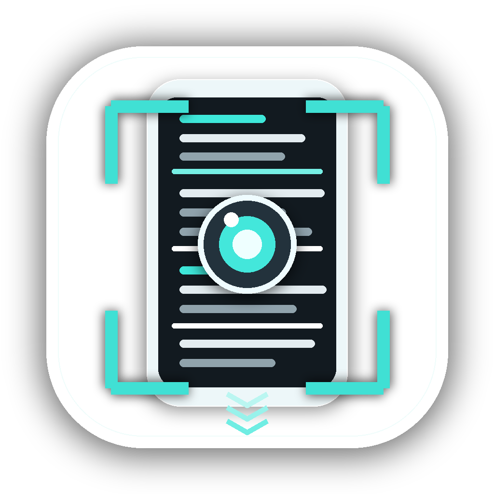

<div align="center">
  
  <h1>OpenSS</h1>
  <p><strong>A minimal macOS menu bar app for long screenshots. Pick a window, auto-scroll to the end, and save one clean PNG.</strong></p>

  <p>
    <a href="#features">Features</a> •
    <a href="#getting-started">Getting Started</a> •
    <a href="#usage">Usage</a> •
    <a href="#permissions">Permissions</a> •
    <a href="#website-demo">Website Demo</a> •
    <a href="#tech-stack">Tech Stack</a>
  </p>

  <p>
    
    
    
    
  </p>
</div>

## Features

- Native macOS menu bar app
- Global shortcut: `Command + Shift + L`
- Menu bar preview popover with visible window thumbnails
- Click a window to start capture immediately
- Automatic scrolling until the page stops changing
- `Content only` mode to crop browser chrome such as tabs, address bars, and bookmark bars
- Saves stitched screenshots as PNG files on your Desktop
- Red/green permission state when attention is needed
- One-click app restart after granting macOS privacy permissions
- Signed app bundle build script
- OpenSS app icon and macOS `.icns` assets
- Interactive website demo that recreates the menu bar workflow

## Getting Started

### Requirements

- macOS 14+
- Xcode 26+
- Swift 6+

### Run from Source

```bash
swift run
```

### Build an App Bundle

```bash
chmod +x scripts/build-app.sh
./scripts/build-app.sh
open build/OpenSS.app
```

The build script creates `build/OpenSS.app`, includes the app icon, and signs the bundle with your Apple Development signing identity when one is available.

## Usage

1. Open OpenSS.
2. Grant Screen Recording and Accessibility permissions when macOS asks.
3. Restart OpenSS from the popover after granting permissions.
4. Click the menu bar icon or press `Command + Shift + L`.
5. Hover the window previews to inspect the target.
6. Click a window to start a long screenshot.
7. OpenSS scrolls until the page stops changing and saves a PNG to your Desktop.

Use `Content only` to crop browser UI from Chrome-like browser captures.

## Permissions

Long screenshots need two macOS permissions:

- **Screen Recording:** captures the selected window and enables previews.
- **Accessibility:** lets OpenSS send scroll gestures to the selected app.

macOS privacy permissions are tied to the signed app identity. If Settings shows permissions are enabled but OpenSS still asks, remove the old OpenSS entries from **System Settings → Privacy & Security**, open the newly built app, and enable it once again.

## Current Behavior

OpenSS captures the selected window, clicks into the content area, scrolls automatically, and stops when the next capture is visually similar to the previous one. It keeps an internal safety limit so unusual apps cannot scroll forever.

The current capture implementation uses CoreGraphics window capture APIs. They work for the MVP, but macOS marks them as deprecated; moving to ScreenCaptureKit is the next major reliability upgrade.

## Website Demo

The `website/` folder contains a Next.js demo site inspired by the OpenTimer landing page. It presents OpenSS inside a faux macOS desktop:

- menu bar icon
- picker popover
- hoverable previews
- `Content only` toggle
- simulated capture progress
- stitched long-screenshot result window

```bash
cd website
pnpm install
pnpm dev
```

## Tech Stack

### App

- Swift 6
- AppKit
- CoreGraphics
- ApplicationServices Accessibility APIs
- Carbon global hotkey API

### Website

- Next.js
- React
- Tailwind CSS
- lucide-react

## Releases

There is no packaged DMG release yet. For now, build locally with:

```bash
./scripts/build-app.sh
```

Future release work should add a GitHub Actions workflow to build, sign/notarize, create a DMG, and attach it to GitHub Releases.

## Icon & Assets

- Source icon: `output/imagegen/openss-app-icon-1024.png`
- macOS iconset: `Resources/OpenSS.iconset`
- App icon: `Resources/OpenSS.icns`
- Bundle metadata: `Resources/Info.plist`
